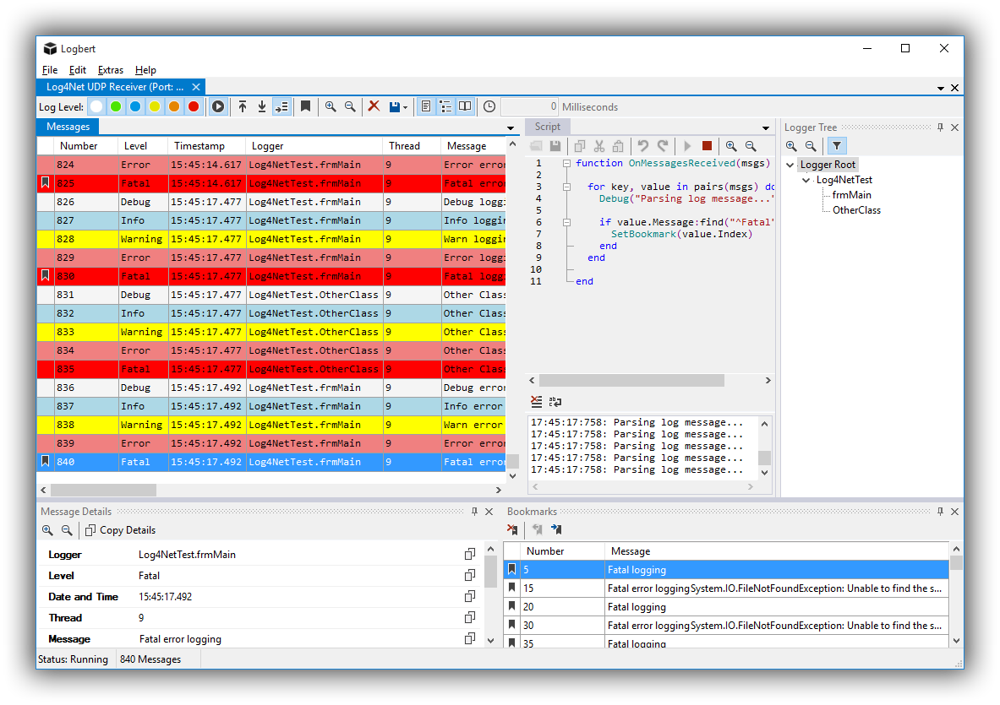

# Logbert
Logbert is an advanced log message viewer for log4net, log4j and others.

### Features
* Multiple log receivers
  * Chainsaw compatible loggers like log4net or nlog (UDP, TCP and File based)
  * Windows event log
  * SysLog events (UDP, TCP and File based)
* Create unlimited count of bookmarks
* Filter log messages using a logger tree and level filter
* Wildcard and regular expression based search
* Optional timeshift in milliseconds for synchronization
* Export log messages to a file as received or as CSV
* Create regular expression based filters
* Embedded LUA script engine
  * Create or remove bookmarks
  * Show a message
  * Access received log messages
  * Trigger function if a new log message is received or a bookmark is changed

### Planned Features
* Customizable log receiver
* Directory based receiving (load multiple log files as one)

### Copyright & License

Copyright (c) 2015 Couchcoding - Released under the [MIT license](LICENSE).
